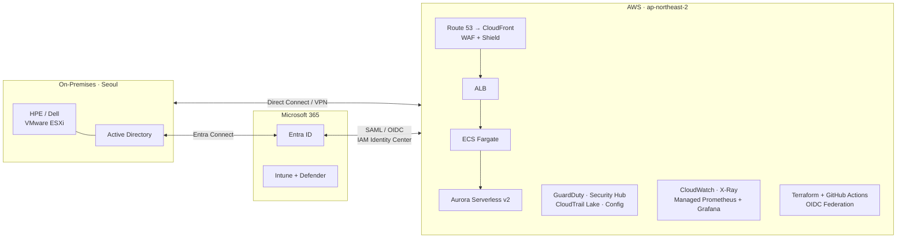

# Cloud Architecture Designs

> A small collection of cloud architecture designs I have built or would build,
> kept here as a learning journey from a 2022 classic 3-tier to a 2026 hybrid
> reference architecture.

## Featured: Hybrid Cloud Reference (2026)

A reference architecture connecting an on-premises Microsoft 365 estate to
a modern AWS landing zone. Models the kind of environment I operate today
(HPE/Dell servers, M365, Cisco network) and how I would extend it into the
cloud.

**See [`designs/02-hybrid-cloud-2026/`](./designs/02-hybrid-cloud-2026/)** for:

- Full architecture write-up with identity, connectivity, security, and
  delivery layers
- Editable [`architecture.drawio`](./designs/02-hybrid-cloud-2026/architecture.drawio)
  source (open in [diagrams.net](https://app.diagrams.net))
- Disaster recovery tiering and cost guardrails

## Earlier work

### [01 -- Classic 3-Tier (2022)](./designs/01-3tier-classic-2022/)

A traditional 3-tier AWS architecture from 2022: ALB → EC2 web tier →
NLB → WAS in private subnets, with Bastion host, Client VPN, CloudTrail,
and CodePipeline. Kept as a learning baseline.

The README in that folder includes a side-by-side comparison of what I
would change in 2026 (Fargate instead of EC2, GitHub Actions instead of
CodeCommit, Session Manager instead of Bastion host, etc.).

## How to view the diagrams

| Format | How to view |
|---|---|
| Mermaid (this README) | Renders inline on GitHub automatically |
| `.drawio` | Open in [diagrams.net](https://app.diagrams.net) (web, free) or download draw.io desktop |
| `.png` | Renders inline in any markdown viewer |

To export a `.drawio` file to PNG: open in diagrams.net → File → Export As → PNG.

## Author

Byeongki "Ki" Cho -- bilingual cloud and infrastructure engineer in Seoul.
[LinkedIn](https://www.linkedin.com/in/byeongkicho)
