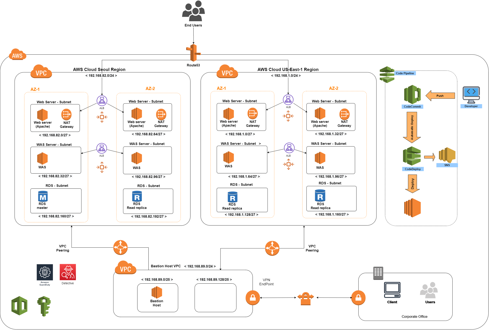

# 01 -- Classic 3-Tier Architecture (2022)

> Original cloud architecture design from 2022, kept here as a learning baseline.

## Design decisions (original 2022)

1. **Multi-AZ, Multi-region** for High Availability
2. Dedicated VPC for the production environment
3. AutoScaling across multiple AZs for dynamic scale-out
4. Linux 2 AMI userdata in the Launch Configuration so Apache installs automatically
5. **ALB** distributes inbound traffic to Web servers across multi-AZ
6. Web tier forwards to **WAS via NLB** for east-west traffic
7. WAS lives in the **PrivateSubnet** and reaches the internet only via NAT for periodic Tomcat updates
8. All VPC traffic egresses through the Internet Gateway
9. **ACM-issued public certificate** terminates SSL on the web ALB
10. Separate VPC + Subnet for the **Bastion host**, connected to the Production VPC via **VPC Peering**
11. **Client VPN Endpoint** for secure access to internal resources from external clients
12. **CloudWatch + CloudTrail** for log analysis, **SNS** for resource event notifications
13. **CodePipeline + CodeCommit + CodeDeploy** for the release process

## What I would change in 2026

This 2022 design is solid for learning AWS primitives, but a current revision would replace several pieces:

| 2022 choice | 2026 alternative | Why |
|---|---|---|
| EC2 + Apache (manual AMI) | **ECS Fargate** or **App Runner** | No AMI maintenance, faster scale, simpler IaM |
| WAS on EC2 | **Containers on Fargate** | Same reason |
| CodeCommit | **GitHub + GitHub Actions** with OIDC to Entra/IAM | CodeCommit is being deprecated |
| ALB → NLB → WAS | **Service Connect** or **App Mesh** | Native service-to-service inside ECS |
| Bastion host EC2 | **AWS Systems Manager Session Manager** | No open ports, no key management |
| Manual SSL on ALB | **ACM + automatic renewal** | Already automated, just verify |
| CloudTrail to CloudWatch | **CloudTrail Lake** or **Security Lake** | Built for log analysis at scale |

The new hybrid design in `designs/02-hybrid-cloud-2026/` reflects these updates and adds the on-premises integration that I work with daily at my current job.
