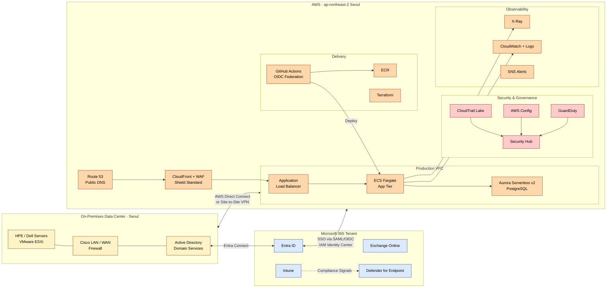

# 02 -- Hybrid Cloud Architecture (2026)

> A reference architecture connecting an on-premises Microsoft 365 estate to
> a modern AWS landing zone. Models the kind of environment I operate today
> and how I would extend it into the cloud.

## Why hybrid

Most enterprises do not "move to cloud." They run a hybrid: identity and
productivity in Microsoft 365, legacy workloads on-premises, and new
workloads in a public cloud (AWS or Azure). The interesting engineering
problems live at the seams -- identity federation, secure connectivity,
unified observability, consistent governance.

This design is the architecture I would build for a mid-size enterprise
that already runs Microsoft 365 and HPE/Dell on-premises infrastructure
(my current production environment) and wants to add AWS as its
cloud-native workload platform.

## Visual

### Inline (Mermaid)

### Editable source (draw.io)

The full diagram lives in [`architecture.drawio`](./architecture.drawio).
Open it in [diagrams.net](https://app.diagrams.net) to edit, then export
to PNG or SVG. A pre-rendered PNG is also committed at
[`architecture.png`](./architecture.png) for browsers that don't open
`.drawio` files inline.

## Identity layer

| Component | Purpose |
|---|---|
| Active Directory (on-prem) | Source of truth for user accounts |
| **Entra Connect** | Hybrid identity bridge: syncs users, groups, password hashes |
| Entra ID | Cloud directory; also publishes SAML / OIDC for AWS |
| **AWS IAM Identity Center** | Federates Entra ID into AWS accounts; users get short-lived credentials |
| Intune | Device compliance signals fed into Defender |
| Defender for Endpoint | Endpoint security; integrates with Conditional Access |

Result: **one identity** governs both M365 and AWS access. No separate
IAM users to manage. Conditional Access policies (e.g. require compliant
device, require MFA) apply uniformly.

## Connectivity layer

| Option | When to choose |
|---|---|
| **AWS Direct Connect** | Production workloads, predictable bandwidth, <2ms latency |
| **Site-to-Site VPN over IPsec** | Lower cost, suitable for management traffic and DR fallback |
| **AWS Transit Gateway** (when scaling) | Multi-VPC hub-and-spoke topology for many accounts |

For the initial deployment I would start with Site-to-Site VPN, then
upgrade to Direct Connect as cross-cloud traffic justifies the fixed
monthly cost. Both terminate in the same VPC subnet.

## Application tier

- **CloudFront + WAF** at the edge for caching, DDoS mitigation, OWASP rule sets
- **Application Load Balancer** in public subnets across two AZs
- **ECS Fargate** in private subnets running containerized services -- no EC2
  to patch, no AMI to maintain
- **Aurora Serverless v2 PostgreSQL** in private subnets, multi-AZ writer/reader
- **ECR** for container images, scanned on push
- **GitHub Actions with OIDC federation** -- no static AWS credentials in CI

## Security and governance

- **GuardDuty** for threat detection on VPC flow logs, DNS logs, S3 events
- **Security Hub** as the single pane of glass for findings
- **AWS Config** with conformance packs (CIS, NIST 800-53, PCI-DSS) for
  continuous compliance evaluation
- **CloudTrail Lake** for searchable, long-retention audit logs
- **IAM Access Analyzer** to detect public exposure on resources
- **AWS WAF** rules tuned to the application

## Observability

- **CloudWatch Logs and Metrics** as the baseline; structured JSON logs
  emitted by every container
- **X-Ray** for distributed tracing across the ALB → Fargate → Aurora path
- **CloudWatch Alarms → SNS** to PagerDuty / Teams for paging
- **CloudWatch Dashboards** scoped per service

In a more mature environment I would add **Grafana on Amazon Managed
Service for Prometheus** to unify on-prem (Prometheus exporters) and AWS
metrics into one view.

## Delivery

- **Terraform** as the IaC tool, state in an S3 bucket with DynamoDB
  locking and KMS encryption
- **GitHub Actions** for CI; PR validation runs `terraform plan`,
  merges trigger `terraform apply` with OIDC federation -- no long-lived
  AWS keys
- **Trunk-based development** with feature flags for risky changes
- **Blue/green deployment** on ECS via CodeDeploy

## Cost guardrails

- **Cost Allocation Tags** required on every resource (`environment`,
  `owner`, `costcenter`)
- **AWS Budgets** with email alerts at 50% / 80% / 100% of monthly target
- **Compute Optimizer** recommendations reviewed monthly
- **S3 Lifecycle Policies** to transition older logs to S3 Glacier
- **Aurora Serverless v2** scales to 0.5 ACU at idle -- no over-provisioning

## Disaster recovery (out of scope for diagram, in scope for design)

| Tier | RTO | RPO | Strategy |
|---|---|---|---|
| Tier 1 -- App | 1 hour | 15 min | Active-passive in `ap-northeast-1`, RDS cross-region replica, Route 53 failover |
| Tier 2 -- Support | 4 hours | 1 hour | Pilot light: AMIs and Terraform state replicated; spin up on demand |
| Tier 3 -- Internal | 24 hours | 24 hours | Backup-restore from S3 cross-region replication |

## What this design demonstrates

- **Hybrid identity** via Entra Connect + IAM Identity Center
- **Network connectivity** patterns (Direct Connect, Site-to-Site VPN)
- **Modern compute** (Fargate, not EC2) with serverless data tier
- **Defense in depth** (WAF, Shield, GuardDuty, Security Hub, Config)
- **Operational maturity** (IaC, OIDC, structured logs, X-Ray, alarms)
- **Cost discipline** (tags, budgets, lifecycle, serverless scale-to-zero)

These are the patterns I would expect to see on day one at a mid-size
enterprise running Microsoft 365 and on-prem alongside a public cloud.
